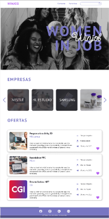

# Winjob
***
## Página web de empleo

El proyecto está pensado con un fin social que busque ayudar a una minoría como lo son las mujeres a encontrar un entorno dónde sus necesidades como la búsqueda de empleo sean atendidas. 
El nombre está pensado mayoritariamente como un juego de palabras en donde “Win” viene del anglicismo “ganar” y “Job” de trabajo. La primera W siempre en mayúscula va a representar a las mujeres del anglicismo “women”. 
 
 

    

        
        
<a href="javascript:void(0);">Taj Group</a>

    

 

 

## Tabla de contenidos
***
1. [Instalación](#Instalación)
2. [Tecnologías](#Tecnologías)
3. [Autores](#Autores)
4. [Licencia](#Licencia)

## Instalación
***
Puedes instalarlo desde npm
 
$ git clone https://github.com/Niguisasola/WomanInJob.git 
$ cd ../path/to/the/file 
$ npm install 
$ npm start
 

## Tecnologías
***
Una lista de las tecnologías utilizadas en el proyecto:
* [Node.Js](https://nodejs.org/es/): Version v16.16.0
 

## Autores
***
Niguisasola Nika 
AleMCuitino Alejandra 
FerNandaRM05 Fernanda 
BarbaraSantano Bárbara 

## Licencia
***
TEAM 19
